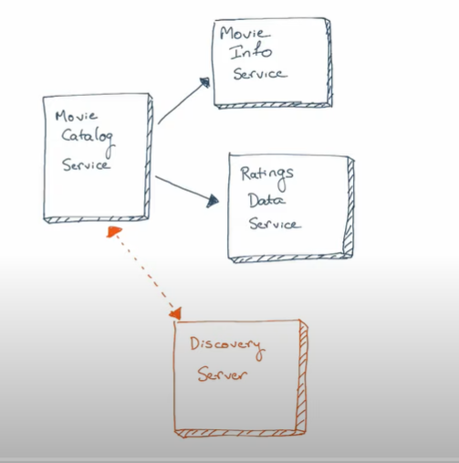
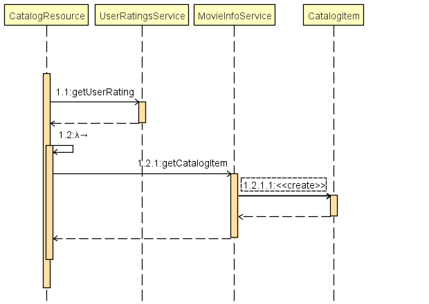

# Introduction

Notes from Spring Boot Microservices workshop by [Java Brains](https://www.youtube.com/c/JavaBrainsChannel)

# Application

Application consists of three microservices:  

* movie-catalog-service
* movie-info-service
* ratings-data-service
* discovery-server

*movie-catalog-service* retrieves movie information from *movie-info-service* and movie ratings from *ratings-data-service*. *Discovery-server* is a microservice to locate each microservices on a network.  

# How to Run

* Run each microservice as a standart Java application
* Run catalog API: http://localhost:8081/catalog/foo
* You can monitor Hystrix for Fault Tolerance: http://localhost:8081/hystrix/monitor?stream=http%3A%2F%2Flocalhost%3A8081%2Factuator%2Fhystrix.stream

# Service Discovery

## Why hardcoded URLs are bad?

* Changes require code updates
* Dynamic URLs in the cloud
* Load balancing
* Multiple environments

## What is the minimum requirement for service discovery?

Discovery server

## Client-side vs Server-side Discovery

**Client-side Discovery**

1. The client asks for a service to the discovery server
2. The discovery server returns the service
3. Client makes the call to the service

https://microservices.io/patterns/client-side-discovery.html

**Server-side Discovery**

1. The client makes a request to a service via a discovery server
2. The discovery server queries the service registry and routes each request to an available service instance

https://microservices.io/patterns/server-side-discovery.html

## Eureka Service Discovery

If your Java version is 11, you will get JAXB errors as JAXB removed from JDK from Java 10 onwards.

`java.lang.TypeNotPresentException: Type javax.xml.bind.JAXBContext not present  
	at java.base/sun.reflect.generics.factory.CoreReflectionFactory.makeNamedType(CoreReflectionFactory.java:117) ~[na:na]
	at java.base/sun.reflect.generics.visitor.Reifier.visitClassTypeSignature(Reifier.java:125) ~[na:na]
	at java.base/sun.reflect.generics.tree.ClassTypeSignature.accept(ClassTypeSignature.java:49) ~[na:na]`  

You need to add the following dependencies below

`<dependency>
		<groupId>com.sun.xml.bind</groupId>
			<artifactId>jaxb-impl</artifactId>
			<version>2.3.0</version>
		</dependency>  
		<dependency>
			<groupId>org.glassfish.jaxb</groupId>
			<artifactId>jaxb-runtime</artifactId>
			<version>2.3.0</version>
		</dependency>
		<dependency>
			<groupId>javax.activation</groupId>
			<artifactId>activation</artifactId>
			<version>1.1.1</version>
		</dependency>
`

# Solutions for slow microservice

## Timeout
If one of your microservices is slow, you can add a timeout to your rest template. however, it doesn't fully solve the issue.

	@LoadBalanced
	@Bean
	public RestTemplate getRestTemplate() {
		HttpComponentsClientHttpRequestFactory clientHttpRequestFactory = new HttpComponentsClientHttpRequestFactory();
		clientHttpRequestFactory.setConnectTimeout(3000);
		return  new RestTemplate(clientHttpRequestFactory);
	}
## Circuit breaker pattern

You have applied the Microservice architecture. Services sometimes collaborate when handling requests. When one service synchronously invokes another there is always the possibility that the other service is unavailable or is exhibiting such high latency it is essentially unusable. Precious resources such as threads might be consumed in the caller while waiting for the other service to respond. This might lead to resource exhaustion, which would make the calling service unable to handle other requests. The failure of one service can potentially cascade to other services throughout the application [[reference](https://microservices.io/patterns/reliability/circuit-breaker.html)]

**This pattern has the following benefits**

* Services handle the failure of the services that they invoke  
* Automatic recovery 

**This pattern has the following issues**

* It is challenging to choose timeout values without creating false positives or introducing excessive latency.

### What to do when a circuit breaks?

* Throw an error - not a good idea
* Return a fallback "default" response - better than throwing an error but not an ideal option
* Cache previous responses and use when possible - this would the best way to handle circuit breaks

# What is Hystrix?

* Netflix has created a library called Hystrix that implements the circuit breaker pattern. 
* A service failure in the lower level of services can cause cascading failure all the way up to the user. Having an open circuit stops cascading failures and allows overwhelmed or failing services time to recover. [[reference](https://cloud.spring.io/spring-cloud-netflix/multi/multi__circuit_breaker_hystrix_clients.html)]

## Adding Hystrix to a Spring Boot app
* Add `spring-cloud-starter-netflix-hystrix` pom dependency

		<dependency>
			<groupId>org.springframework.cloud</groupId>
			<artifactId>spring-cloud-starter-netflix-hystrix</artifactId>
		</dependency>

* Add @EnableCircuitBreaker to the application class
* Add @HystrixCommand to the methods that need circuit breaker
* Configure Hystrix behaviour

